# What are we building?
We are building a spark-cluster with some enhancements, we are adding jupyterhub to provide a convenient way to code and submit applications into our spark-cluster, and we are adding Minio to provide a distributed object storage so it's easier to read and write into files accessible to all workers concurrently.

# Let's prep our minikube environment
First we should start our kubernetes cluster, I am using minikube but there are several other options (k3s, microk8s, kubeadm, etc).
```
minikube start --network=bridge
```
Some times the dns fails silently and only notice once my services can't communicate with each other, to check logs I use the command
```
kubectl -n kube-system logs -f $(kubectl -n kube-system get pods -l k8s-app=kube-dns -o jsonpath="{.items[0].metadata.name}")
```


# Let's create a spark cluster
Follow the commands described at the [spark helm installation](https://github.com/mitsiu-carreno/k8s-spark-lab/tree/main/spark#helm-installation)        

You can follow the installation progress with the first command in [kubernetes monitoring section](https://github.com/mitsiu-carreno/k8s-spark-lab/tree/main/spark#kubernetes-monitoring)        

Once the installation is completed you shoud see a state similar to the following, notice the column STATUS=Running:
> NAME&nbsp;&nbsp;&nbsp;&nbsp;&nbsp;&nbsp;&nbsp;&nbsp;&nbsp;&nbsp;&nbsp;&nbsp;&nbsp;&nbsp;&nbsp;&nbsp;&nbsp;&nbsp;&nbsp;&nbsp;&nbsp;&nbsp;&nbsp;&nbsp;&nbsp;&nbsp;READY   STATUS    RESTARTS   AGE          
> pod/spark-cluster-master-0&nbsp;&nbsp;&nbsp;1/1&nbsp;&nbsp;&nbsp;&nbsp;&nbsp;Running&nbsp;&nbsp;&nbsp;0&nbsp;&nbsp;&nbsp;&nbsp;&nbsp;&nbsp;&nbsp;&nbsp;&nbsp;&nbsp;4m         
> pod/spark-cluster-worker-0&nbsp;&nbsp;&nbsp;1/1&nbsp;&nbsp;&nbsp;&nbsp;&nbsp;Running&nbsp;&nbsp;&nbsp;0&nbsp;&nbsp;&nbsp;&nbsp;&nbsp;&nbsp;&nbsp;&nbsp;&nbsp;&nbsp;4m         
> pod/spark-cluster-worker-1&nbsp;&nbsp;&nbsp;1/1&nbsp;&nbsp;&nbsp;&nbsp;&nbsp;Running&nbsp;&nbsp;&nbsp;0&nbsp;&nbsp;&nbsp;&nbsp;&nbsp;&nbsp;&nbsp;&nbsp;&nbsp;&nbsp;48s        
>           
> NAME&nbsp;&nbsp;&nbsp;&nbsp;&nbsp;&nbsp;&nbsp;&nbsp;&nbsp;&nbsp;&nbsp;&nbsp;&nbsp;&nbsp;&nbsp;&nbsp;&nbsp;&nbsp;&nbsp;&nbsp;&nbsp;&nbsp;&nbsp;&nbsp;&nbsp;&nbsp;&nbsp;&nbsp;&nbsp;&nbsp;&nbsp;TYPE&nbsp;&nbsp;&nbsp;&nbsp;&nbsp;&nbsp;&nbsp;&nbsp;CLUSTER-IP&nbsp;&nbsp;&nbsp;&nbsp;&nbsp;&nbsp;&nbsp;EXTERNAL-IP&nbsp;&nbsp;&nbsp;PORT(S)&nbsp;&nbsp;&nbsp;&nbsp;&nbsp;&nbsp;&nbsp;&nbsp;&nbsp;&nbsp;&nbsp;AGE         
> service/spark-cluster-headless&nbsp;&nbsp;&nbsp;&nbsp;&nbsp;ClusterIP&nbsp;&nbsp;&nbsp;None&nbsp;&nbsp;&nbsp;&nbsp;&nbsp;&nbsp;&nbsp;&nbsp;&nbsp;&nbsp;&nbsp;&nbsp;&nbsp;<none>&nbsp;&nbsp;&nbsp;&nbsp;&nbsp;&nbsp;&nbsp;&nbsp;<none>&nbsp;&nbsp;&nbsp;&nbsp;&nbsp;&nbsp;&nbsp;&nbsp;&nbsp;&nbsp;&nbsp;&nbsp;4m        
> service/spark-cluster-master-svc&nbsp;&nbsp;&nbsp;ClusterIP&nbsp;&nbsp;&nbsp;10.102.130.157&nbsp;&nbsp;&nbsp;<none>&nbsp;&nbsp;&nbsp;&nbsp;&nbsp;&nbsp;&nbsp;&nbsp;7077/TCP,80/TCP&nbsp;&nbsp;&nbsp;4m        
>          
> NAME&nbsp;&nbsp;&nbsp;&nbsp;&nbsp;&nbsp;&nbsp;&nbsp;&nbsp;&nbsp;&nbsp;&nbsp;&nbsp;&nbsp;&nbsp;&nbsp;&nbsp;&nbsp;&nbsp;&nbsp;&nbsp;&nbsp;&nbsp;&nbsp;&nbsp;&nbsp;&nbsp;&nbsp;&nbsp;&nbsp;&nbsp;&nbsp;&nbsp;&nbsp;&nbsp;&nbsp;READY&nbsp;&nbsp;&nbsp;AGE       
> statefulset.apps/spark-cluster-master&nbsp;&nbsp;&nbsp;1/1&nbsp;&nbsp;&nbsp;&nbsp;&nbsp;4m        
> statefulset.apps/spark-cluster-worker&nbsp;&nbsp;&nbsp;2/2&nbsp;&nbsp;&nbsp;&nbsp;&nbsp;4m         

By default, spark will create one master node and two worker nodes.      

We can now enable port 8080 (or any other) to access the master web UI with the second command in [kubernetes monitoring section](https://github.com/mitsiu-carreno/k8s-spark-lab/tree/main/spark#kubernetes-monitoring)        

Entering localhost:8080 on the browser in the host machine should show a screen like:
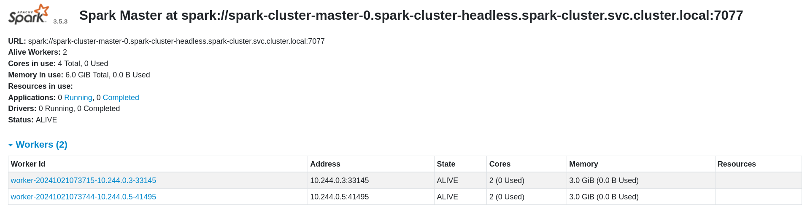

This screen should helps us validate several configurations, from top to bottom: 
1. **Alive Workers: 2** which match the two workers listed above.
2. **Cores in use: 4 Total, 0 Used** this means 2 cores per worker (also shown in the workers table below), this matches the `worker.coreLimit` defined in [values.yml](https://github.com/mitsiu-carreno/k8s-spark-lab/blob/main/spark/values.yml)
3. **Memory in use: 6.0 GiB Total, 0.0 B Used** this means 3 Gb per worker (also shown in the workers table below), this matches the `worker.memoryLimit` defined in [values.yml](https://github.com/mitsiu-carreno/k8s-spark-lab/blob/main/spark/values.yml)

Sometimes workers aren't able to connect with the master node, resulting in less or none worker shown. To debug this issue you can see logs from both master and worker nodes
```
# To see master logs
kubectl -n spark-cluster logs -f spark-cluster-master-0
# To see specific worker logs
kubectl -n spark-cluster logs -f spark-cluster-worker-0
```

Usually at this stage master logs will end with:       
> ...         
> 24/10/21 07:37:16 INFO Master: I have been elected leader! New state: ALIVE         
> 24/10/21 07:37:39 INFO Master: Registering worker 10.244.0.3:33145 with 2 cores, 3.0 GiB RAM          
> 24/10/21 07:37:47 INFO Master: Registering worker 10.244.0.5:41495 with 2 cores, 3.0 GiB RAM          

We see a log for each worker registered         

Worker logs at this stage will end with:
> ...                       
> Caused by: io.netty.channel.AbstractChannel$AnnotatedConnectException: Connection refused: spark-cluster-master-svc/10.102.130.157:7077               
> Caused by: java.net.ConnectException: Connection refused          
>&nbsp;&nbsp;at java.base/sun.nio.ch.Net.pollConnect(Native Method)            
>&nbsp;&nbsp;at java.base/sun.nio.ch.Net.pollConnectNow(Net.java:672)            
>&nbsp;&nbsp;at java.base/sun.nio.ch.SocketChannelImpl.finishConnect(SocketChannelImpl.java:946)              
>&nbsp;&nbsp;at io.netty.channel.socket.nio.NioSocketChannel.doFinishConnect(NioSocketChannel.java:337)           
>&nbsp;&nbsp;at io.netty.channel.nio.AbstractNioChannel$AbstractNioUnsafe.finishConnect(AbstractNioChannel.java:334)                
>&nbsp;&nbsp;at io.netty.channel.nio.NioEventLoop.processSelectedKey(NioEventLoop.java:776)                
>&nbsp;&nbsp;at io.netty.channel.nio.NioEventLoop.processSelectedKeysOptimized(NioEventLoop.java:724)                  
>&nbsp;&nbsp;at io.netty.channel.nio.NioEventLoop.processSelectedKeys(NioEventLoop.java:650)                  
>&nbsp;&nbsp;at io.netty.channel.nio.NioEventLoop.run(NioEventLoop.java:562)                   
>&nbsp;&nbsp;at io.netty.util.concurrent.SingleThreadEventExecutor$4.run(SingleThreadEventExecutor.java:997)                
>&nbsp;&nbsp;at io.netty.util.internal.ThreadExecutorMap$2.run(ThreadExecutorMap.java:74)                
>&nbsp;&nbsp;at io.netty.util.concurrent.FastThreadLocalRunnable.run(FastThreadLocalRunnable.java:30)                
>&nbsp;&nbsp;at java.base/java.lang.Thread.run(Thread.java:840)           
> 24/10/21 07:37:39 INFO Worker: Retrying connection to master (attempt # 2)          
> 24/10/21 07:37:39 INFO Worker: Connecting to master spark-cluster-master-svc:7077...         
> 24/10/21 07:37:39 INFO TransportClientFactory: Successfully created connection to spark-cluster-master-svc/10.102.130.157:7077 after 2 ms (0 ms spent in bootstraps)                 
> 24/10/21 07:37:39 INFO Worker: Successfully registered with master spark://spark-cluster-master-0.spark-cluster-headless.spark-cluster.svc.cluster.local:7077              
> 24/10/21 07:37:39 INFO Worker: WorkerWebUI is available at http://localhost:8080/proxy/worker-20241021073715-10.244.0.3-33145                   

As we can see, the worker tried to connect with master but failed, then at 07:37:39 it retry again and succeed, this is because worker usually is ready before both master and spark-cluster-master-svc service.       

**Errors at this stage are usually related with a failure in kubernetes services or kubernetes DNS**

If the cluster is working as exepcted you can try to [run some apps](https://github.com/mitsiu-carreno/k8s-spark-lab/tree/main/spark#launcing-applications-to-the-spark-cluster) or [change resources in the cluster](https://github.com/mitsiu-carreno/k8s-spark-lab/tree/main/spark#change-resources-in-the-spark-cluster).      

# Adding our input files
As mentioned spark requires input files to be present in **ALL** nodes (master and all workers), but honestly who wants to copy the same files multiple times? I don't, that's why we will instead use Minio.

Follow the commands described at the [minio helm installation](https://github.com/mitsiu-carreno/k8s-spark-lab/tree/main/minio#helm-installation)        

Once the minio deployment is ready, we can [access the web console](https://github.com/mitsiu-carreno/k8s-spark-lab/tree/main/minio#accessing-web-console) and should be able to see something similar to:
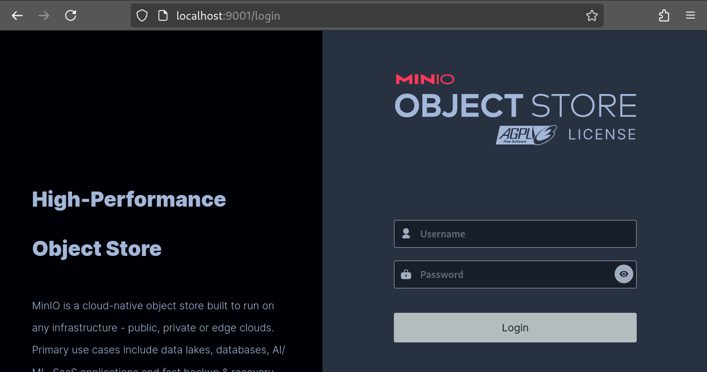

Once you access with the correct credentials we will see a dashboard like this one, lets click on "Create a bucket"
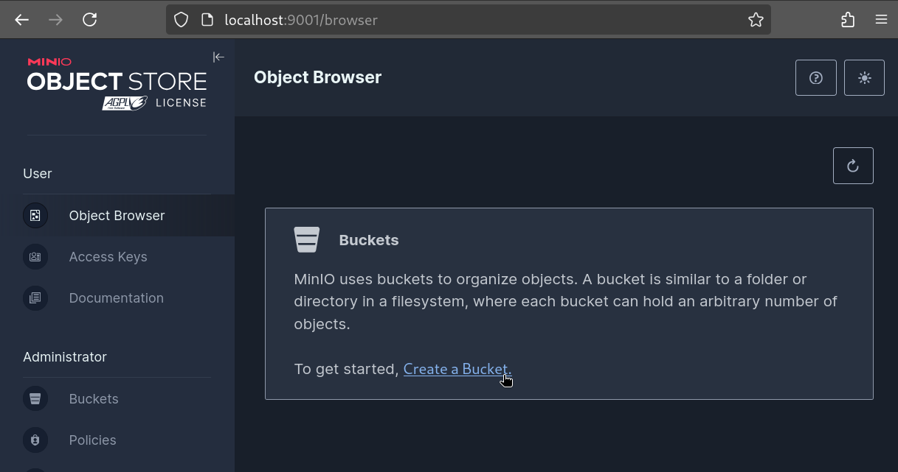
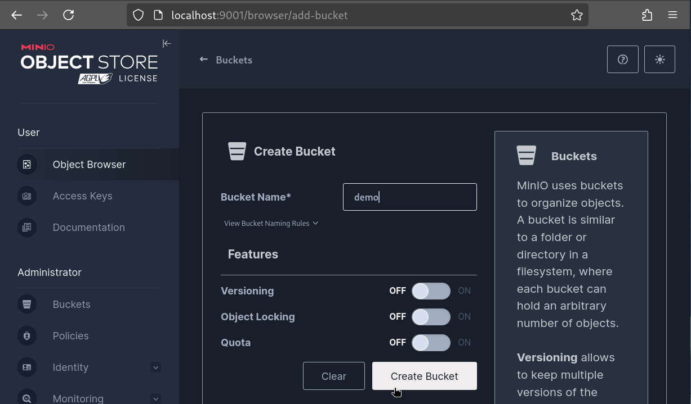
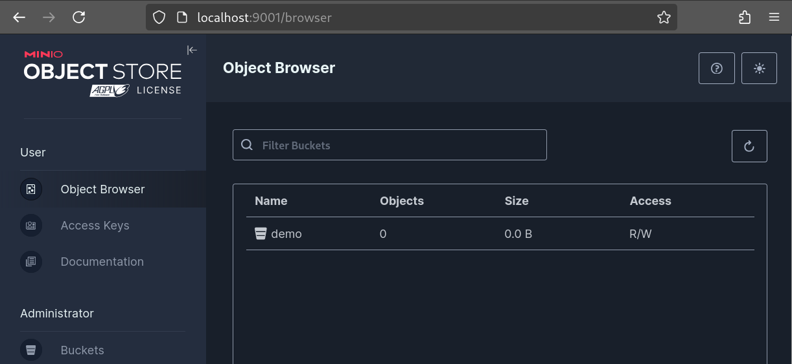

Inside the bucket created lets create a path (folder) named "input"
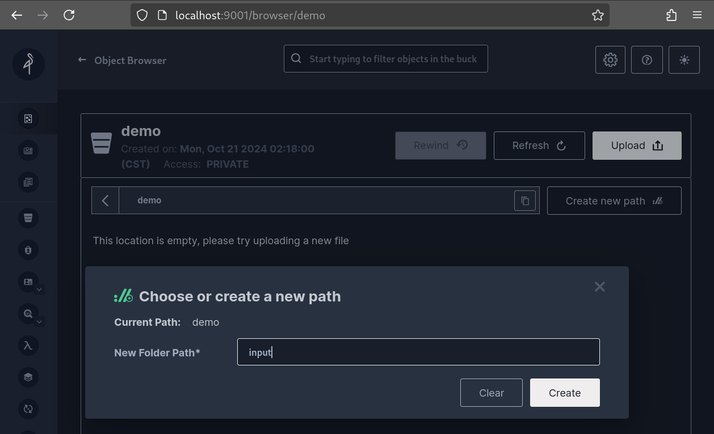

Finally at "demo/input" we can upload all files to be analized
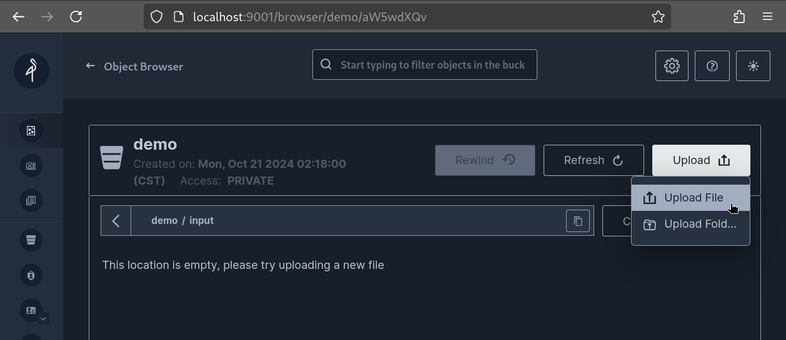

Once upload is completed a list of all uploaded files should appear
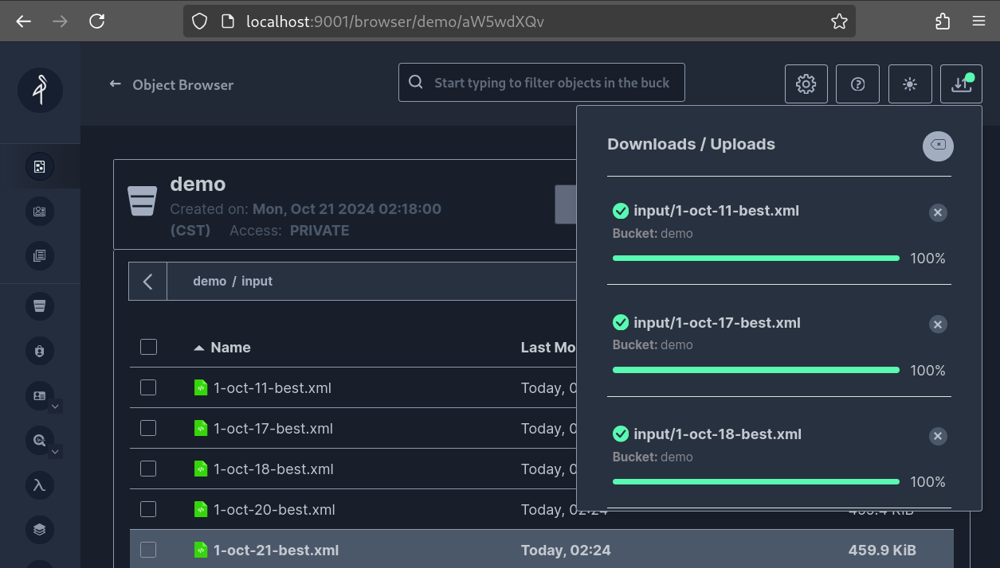

With the files ready we can move on to the last part

# A nice jupyter notebook ui
Finally we just need a nice user interface to write and send our applications to the spark cluster, this can be achieved with jupyterhub but before we need to ensure that the jupyter notebook has the right python version and java installed, for this we have to create our own image.

## Custom jupyter kernel
If you have access to a registry (e.g. [Docker hub](https://hub.docker.com/), [AWS ECS](https://aws.amazon.com/ecr/), etc) you can skip to [Kernel contents](https://github.com/mitsiu-carreno/k8s-spark-lab/tree/main/how-to-cluster.md#Kernel-contents)

### Local registry
In my case, I am running kubernetes in minikube, and I want my local registry to be accessible from within kubernetes so I will create my registry inside my kubernetes cluster.
First I go from my host into my kubernetes cluster
```
minikube ssh
```
Inside my kubernetes cluster follow the instructions for [seting up a local registry](https://github.com/mitsiu-carreno/k8s-spark-lab/tree/main/local_registry#registry-setup)

### Kernel contents
At the directory [jupyterhub/Dockerfile](https://github.com/mitsiu-carreno/k8s-spark-lab/blob/main/jupyterhub/Dockerfile) we find the kernel to be build, in it we can specify the python version, and install java.     
If we want to push the image to a local registry, we have to copy the file into the kubernetes cluster; from the previous step `minikube ssh` I just copy the Dockerfile content into clipboard, and paste at /tmp/images (folder not created before).

### Pusing to registry
Once we have our Dockerfile at the correct place (in my case inside kubernetes) I follow the commands in [pushing image into registry](https://github.com/mitsiu-carreno/k8s-spark-lab/tree/main/local_registry#pushing-image-into-our-registry) if you are using any other registry, substitute `localhost:5000` with the appropriate url.

**Just make sure that the repo and tag used match the one in [image.name in jupyterhub values.yml](https://github.com/mitsiu-carreno/k8s-spark-lab/blob/main/jupyterhub/values.yml#L4)**

Once this step is completed we no longer need to be in the kubernetes cluster (so if you did `minikube ssh` you might do `exit`)

# Deploying jupyter
Similiar to spark and minio we will start by [installing helm chart](https://github.com/mitsiu-carreno/k8s-spark-lab/tree/main/jupyterhub#helm-installation). 

A successfull deployment should look like this:

> NAME&nbsp;&nbsp;&nbsp;&nbsp;&nbsp;&nbsp;&nbsp;&nbsp;&nbsp;&nbsp;&nbsp;&nbsp;&nbsp;&nbsp;&nbsp;&nbsp;&nbsp;&nbsp;&nbsp;&nbsp;&nbsp;&nbsp;&nbsp;&nbsp;&nbsp;&nbsp;&nbsp;&nbsp;&nbsp;&nbsp;&nbsp;&nbsp;&nbsp;READY&nbsp;&nbsp;&nbsp;STATUS&nbsp;&nbsp;&nbsp;&nbsp;RESTARTS&nbsp;&nbsp;&nbsp;AGE             
> pod/continuous-image-puller-crsrz&nbsp;&nbsp;&nbsp;&nbsp;1/1&nbsp;&nbsp;&nbsp;&nbsp;&nbsp;Running&nbsp;&nbsp;&nbsp;0&nbsp;&nbsp;&nbsp;&nbsp;&nbsp;&nbsp;&nbsp;&nbsp;&nbsp;&nbsp;2m19s             
> pod/hub-7d457d76b9-lvdnj&nbsp;&nbsp;&nbsp;&nbsp;&nbsp;&nbsp;&nbsp;&nbsp;&nbsp;&nbsp;&nbsp;&nbsp;&nbsp;1/1&nbsp;&nbsp;&nbsp;&nbsp;&nbsp;Running&nbsp;&nbsp;&nbsp;0&nbsp;&nbsp;&nbsp;&nbsp;&nbsp;&nbsp;&nbsp;&nbsp;&nbsp;&nbsp;2m19s             
> pod/proxy-6d5df59564-jsdvs&nbsp;&nbsp;&nbsp;&nbsp;&nbsp;&nbsp;&nbsp;&nbsp;&nbsp;&nbsp;&nbsp;1/1&nbsp;&nbsp;&nbsp;&nbsp;&nbsp;Running&nbsp;&nbsp;&nbsp;0&nbsp;&nbsp;&nbsp;&nbsp;&nbsp;&nbsp;&nbsp;&nbsp;&nbsp;&nbsp;2m19s             
> pod/user-scheduler-f4f4f6f8b-7t2fh&nbsp;&nbsp;&nbsp;1/1&nbsp;&nbsp;&nbsp;&nbsp;&nbsp;Running&nbsp;&nbsp;&nbsp;0&nbsp;&nbsp;&nbsp;&nbsp;&nbsp;&nbsp;&nbsp;&nbsp;&nbsp;&nbsp;2m19s             
> pod/user-scheduler-f4f4f6f8b-zbz8g&nbsp;&nbsp;&nbsp;1/1&nbsp;&nbsp;&nbsp;&nbsp;&nbsp;Running&nbsp;&nbsp;&nbsp;0&nbsp;&nbsp;&nbsp;&nbsp;&nbsp;&nbsp;&nbsp;&nbsp;&nbsp;&nbsp;2m19s             
>              
> NAME&nbsp;&nbsp;&nbsp;&nbsp;&nbsp;&nbsp;&nbsp;&nbsp;&nbsp;&nbsp;&nbsp;&nbsp;&nbsp;&nbsp;&nbsp;&nbsp;&nbsp;&nbsp;&nbsp;TYPE&nbsp;&nbsp;&nbsp;&nbsp;&nbsp;&nbsp;&nbsp;&nbsp;&nbsp;&nbsp;&nbsp;CLUSTER-IP&nbsp;&nbsp;&nbsp;&nbsp;&nbsp;&nbsp;&nbsp;EXTERNAL-IP&nbsp;&nbsp;&nbsp;PORT(S)&nbsp;&nbsp;&nbsp;&nbsp;&nbsp;&nbsp;&nbsp;&nbsp;AGE             
> service/hub&nbsp;&nbsp;&nbsp;&nbsp;&nbsp;&nbsp;&nbsp;&nbsp;&nbsp;&nbsp;&nbsp;&nbsp;ClusterIP&nbsp;&nbsp;&nbsp;&nbsp;&nbsp;&nbsp;10.104.223.239&nbsp;&nbsp;&nbsp;<none>&nbsp;&nbsp;&nbsp;&nbsp;&nbsp;&nbsp;&nbsp;&nbsp;8081/TCP&nbsp;&nbsp;&nbsp;&nbsp;&nbsp;&nbsp;&nbsp;2m20s             
> service/proxy-api&nbsp;&nbsp;&nbsp;&nbsp;&nbsp;&nbsp;ClusterIP&nbsp;&nbsp;&nbsp;&nbsp;&nbsp;&nbsp;10.102.186.223&nbsp;&nbsp;&nbsp;<none>&nbsp;&nbsp;&nbsp;&nbsp;&nbsp;&nbsp;&nbsp;&nbsp;8001/TCP&nbsp;&nbsp;&nbsp;&nbsp;&nbsp;&nbsp;&nbsp;2m20s             
> service/proxy-public&nbsp;&nbsp;&nbsp;LoadBalancer&nbsp;&nbsp;&nbsp;10.105.168.15&nbsp;&nbsp;&nbsp;&nbsp;<pending>&nbsp;&nbsp;&nbsp;&nbsp;&nbsp;80:30280/TCP&nbsp;&nbsp;&nbsp;2m20s             
>              
> NAME&nbsp;&nbsp;&nbsp;&nbsp;&nbsp;&nbsp;&nbsp;&nbsp;&nbsp;&nbsp;&nbsp;&nbsp;&nbsp;&nbsp;&nbsp;&nbsp;&nbsp;&nbsp;&nbsp;&nbsp;&nbsp;&nbsp;&nbsp;&nbsp;&nbsp;&nbsp;&nbsp;&nbsp;&nbsp;&nbsp;&nbsp;&nbsp;&nbsp;&nbsp;&nbsp;&nbsp;&nbsp;DESIRED&nbsp;&nbsp;&nbsp;CURRENT&nbsp;&nbsp;&nbsp;READY&nbsp;&nbsp;&nbsp;UP-TO-DATE&nbsp;&nbsp;&nbsp;AVAILABLE&nbsp;&nbsp;&nbsp;NODE&nbsp;SELECTOR&nbsp;&nbsp;&nbsp;AGE             
> daemonset.apps/continuous-image-puller&nbsp;&nbsp;&nbsp;1&nbsp;&nbsp;&nbsp;&nbsp;&nbsp;&nbsp;&nbsp;&nbsp;&nbsp;1&nbsp;&nbsp;&nbsp;&nbsp;&nbsp;&nbsp;&nbsp;&nbsp;&nbsp;1&nbsp;&nbsp;&nbsp;&nbsp;&nbsp;&nbsp;&nbsp;1&nbsp;&nbsp;&nbsp;&nbsp;&nbsp;&nbsp;&nbsp;&nbsp;&nbsp;&nbsp;&nbsp;&nbsp;1&nbsp;&nbsp;&nbsp;&nbsp;&nbsp;&nbsp;&nbsp;&nbsp;&nbsp;&nbsp;&nbsp;<none>&nbsp;&nbsp;&nbsp;&nbsp;&nbsp;&nbsp;&nbsp;&nbsp;&nbsp;&nbsp;2m20s             
>              
> NAME&nbsp;&nbsp;&nbsp;&nbsp;&nbsp;&nbsp;&nbsp;&nbsp;&nbsp;&nbsp;&nbsp;&nbsp;&nbsp;&nbsp;&nbsp;&nbsp;&nbsp;&nbsp;&nbsp;&nbsp;&nbsp;&nbsp;&nbsp;&nbsp;&nbsp;&nbsp;&nbsp;&nbsp;&nbsp;READY&nbsp;&nbsp;&nbsp;UP-TO-DATE&nbsp;&nbsp;&nbsp;AVAILABLE&nbsp;&nbsp;&nbsp;AGE             
> deployment.apps/hub&nbsp;&nbsp;&nbsp;&nbsp;&nbsp;&nbsp;&nbsp;&nbsp;&nbsp;&nbsp;&nbsp;&nbsp;&nbsp;&nbsp;1/1&nbsp;&nbsp;&nbsp;&nbsp;&nbsp;1&nbsp;&nbsp;&nbsp;&nbsp;&nbsp;&nbsp;&nbsp;&nbsp;&nbsp;&nbsp;&nbsp;&nbsp;1&nbsp;&nbsp;&nbsp;&nbsp;&nbsp;&nbsp;&nbsp;&nbsp;&nbsp;&nbsp;&nbsp;2m20s             
> deployment.apps/proxy&nbsp;&nbsp;&nbsp;&nbsp;&nbsp;&nbsp;&nbsp;&nbsp;&nbsp;&nbsp;&nbsp;&nbsp;1/1&nbsp;&nbsp;&nbsp;&nbsp;&nbsp;1&nbsp;&nbsp;&nbsp;&nbsp;&nbsp;&nbsp;&nbsp;&nbsp;&nbsp;&nbsp;&nbsp;&nbsp;1&nbsp;&nbsp;&nbsp;&nbsp;&nbsp;&nbsp;&nbsp;&nbsp;&nbsp;&nbsp;&nbsp;2m20s             
> deployment.apps/user-scheduler&nbsp;&nbsp;&nbsp;2/2&nbsp;&nbsp;&nbsp;&nbsp;&nbsp;2&nbsp;&nbsp;&nbsp;&nbsp;&nbsp;&nbsp;&nbsp;&nbsp;&nbsp;&nbsp;&nbsp;&nbsp;2&nbsp;&nbsp;&nbsp;&nbsp;&nbsp;&nbsp;&nbsp;&nbsp;&nbsp;&nbsp;&nbsp;2m20s             
>              
> NAME&nbsp;&nbsp;&nbsp;&nbsp;&nbsp;&nbsp;&nbsp;&nbsp;&nbsp;&nbsp;&nbsp;&nbsp;&nbsp;&nbsp;&nbsp;&nbsp;&nbsp;&nbsp;&nbsp;&nbsp;&nbsp;&nbsp;&nbsp;&nbsp;&nbsp;&nbsp;&nbsp;&nbsp;&nbsp;&nbsp;&nbsp;&nbsp;&nbsp;&nbsp;&nbsp;&nbsp;&nbsp;&nbsp;&nbsp;DESIRED&nbsp;&nbsp;&nbsp;CURRENT&nbsp;&nbsp;&nbsp;READY&nbsp;&nbsp;&nbsp;AGE             
> replicaset.apps/hub-7d457d76b9&nbsp;&nbsp;&nbsp;&nbsp;&nbsp;&nbsp;&nbsp;&nbsp;&nbsp;&nbsp;&nbsp;&nbsp;&nbsp;1&nbsp;&nbsp;&nbsp;&nbsp;&nbsp;&nbsp;&nbsp;&nbsp;&nbsp;1&nbsp;&nbsp;&nbsp;&nbsp;&nbsp;&nbsp;&nbsp;&nbsp;&nbsp;1&nbsp;&nbsp;&nbsp;&nbsp;&nbsp;&nbsp;&nbsp;2m19s             
> replicaset.apps/proxy-6d5df59564&nbsp;&nbsp;&nbsp;&nbsp;&nbsp;&nbsp;&nbsp;&nbsp;&nbsp;&nbsp;&nbsp;1&nbsp;&nbsp;&nbsp;&nbsp;&nbsp;&nbsp;&nbsp;&nbsp;&nbsp;1&nbsp;&nbsp;&nbsp;&nbsp;&nbsp;&nbsp;&nbsp;&nbsp;&nbsp;1&nbsp;&nbsp;&nbsp;&nbsp;&nbsp;&nbsp;&nbsp;2m19s             
> replicaset.apps/user-scheduler-f4f4f6f8b&nbsp;&nbsp;&nbsp;2&nbsp;&nbsp;&nbsp;&nbsp;&nbsp;&nbsp;&nbsp;&nbsp;&nbsp;2&nbsp;&nbsp;&nbsp;&nbsp;&nbsp;&nbsp;&nbsp;&nbsp;&nbsp;2&nbsp;&nbsp;&nbsp;&nbsp;&nbsp;&nbsp;&nbsp;2m19s             
>              
> NAME&nbsp;&nbsp;&nbsp;&nbsp;&nbsp;&nbsp;&nbsp;&nbsp;&nbsp;&nbsp;&nbsp;&nbsp;&nbsp;&nbsp;&nbsp;&nbsp;&nbsp;&nbsp;&nbsp;&nbsp;&nbsp;&nbsp;&nbsp;&nbsp;&nbsp;&nbsp;&nbsp;&nbsp;&nbsp;&nbsp;&nbsp;&nbsp;READY&nbsp;&nbsp;&nbsp;AGE             
> statefulset.apps/user-placeholder&nbsp;&nbsp;&nbsp;0/0&nbsp;&nbsp;&nbsp;&nbsp;&nbsp;2m19s             

A non-successfull deployment probably will fail at this pod
> NAME&nbsp;&nbsp;&nbsp;&nbsp;&nbsp;&nbsp;&nbsp;&nbsp;&nbsp;&nbsp;&nbsp;&nbsp;&nbsp;&nbsp;&nbsp;&nbsp;&nbsp;&nbsp;&nbsp;&nbsp;&nbsp;&nbsp;&nbsp;&nbsp;&nbsp;&nbsp;&nbsp;&nbsp;&nbsp;&nbsp;&nbsp;&nbsp;&nbsp;READY&nbsp;&nbsp;&nbsp;STATUS&nbsp;&nbsp;&nbsp;&nbsp;&nbsp;&nbsp;&nbsp;&nbsp;&nbsp;&nbsp;&nbsp;RESTARTS&nbsp;&nbsp;&nbsp;AGE             
> pod/continuous-image-puller-n57rd&nbsp;&nbsp;&nbsp;&nbsp;1/1&nbsp;&nbsp;&nbsp;&nbsp;&nbsp;ErrImagePull&nbsp;&nbsp;&nbsp;&nbsp;&nbsp;0&nbsp;&nbsp;&nbsp;&nbsp;&nbsp;&nbsp;&nbsp;&nbsp;&nbsp;&nbsp;5m55s             
> ...             

This means that Docker was unable to find our custom-made container image from step "Kernel contents" to debug you can try the command:
```
kubectl -n jupyterhub describe pod/continuous-image-puller-n57rd
```
And on the last section you'll see the problem
> ...
> Events:
> &nbsp;&nbsp;Type&nbsp;&nbsp;&nbsp;&nbsp;&nbsp;Reason&nbsp;&nbsp;&nbsp;&nbsp;&nbsp;Age&nbsp;&nbsp;&nbsp;&nbsp;&nbsp;&nbsp;&nbsp;&nbsp;&nbsp;&nbsp;&nbsp;&nbsp;&nbsp;&nbsp;&nbsp;&nbsp;From&nbsp;&nbsp;&nbsp;&nbsp;&nbsp;&nbsp;&nbsp;&nbsp;&nbsp;&nbsp;&nbsp;&nbsp;&nbsp;&nbsp;&nbsp;Message
> &nbsp;&nbsp;----&nbsp;&nbsp;&nbsp;&nbsp;&nbsp;------&nbsp;&nbsp;&nbsp;&nbsp;&nbsp;----&nbsp;&nbsp;&nbsp;&nbsp;&nbsp;&nbsp;&nbsp;&nbsp;&nbsp;&nbsp;&nbsp;&nbsp;&nbsp;&nbsp;&nbsp;----&nbsp;&nbsp;&nbsp;&nbsp;&nbsp;&nbsp;&nbsp;&nbsp;&nbsp;&nbsp;&nbsp;&nbsp;&nbsp;&nbsp;&nbsp;-------
> &nbsp;&nbsp;Normal&nbsp;&nbsp;&nbsp;Scheduled&nbsp;&nbsp;46s&nbsp;&nbsp;&nbsp;&nbsp;&nbsp;&nbsp;&nbsp;&nbsp;&nbsp;&nbsp;&nbsp;&nbsp;&nbsp;&nbsp;&nbsp;&nbsp;default-scheduler&nbsp;&nbsp;Successfully assigned jupyterhub/continuous-image-puller-n57rd to minikube
> &nbsp;&nbsp;Normal&nbsp;&nbsp;&nbsp;Pulled&nbsp;&nbsp;&nbsp;&nbsp;&nbsp;45s&nbsp;&nbsp;&nbsp;&nbsp;&nbsp;&nbsp;&nbsp;&nbsp;&nbsp;&nbsp;&nbsp;&nbsp;&nbsp;&nbsp;&nbsp;&nbsp;kubelet&nbsp;&nbsp;&nbsp;&nbsp;&nbsp;&nbsp;&nbsp;&nbsp;&nbsp;&nbsp;&nbsp;&nbsp;Container image "quay.io/jupyterhub/k8s-network-tools:3.3.8" already present on machine
> &nbsp;&nbsp;Normal&nbsp;&nbsp;&nbsp;Created&nbsp;&nbsp;&nbsp;&nbsp;45s&nbsp;&nbsp;&nbsp;&nbsp;&nbsp;&nbsp;&nbsp;&nbsp;&nbsp;&nbsp;&nbsp;&nbsp;&nbsp;&nbsp;&nbsp;&nbsp;kubelet&nbsp;&nbsp;&nbsp;&nbsp;&nbsp;&nbsp;&nbsp;&nbsp;&nbsp;&nbsp;&nbsp;&nbsp;Created container image-pull-metadata-block
> &nbsp;&nbsp;Normal&nbsp;&nbsp;&nbsp;Started&nbsp;&nbsp;&nbsp;&nbsp;45s&nbsp;&nbsp;&nbsp;&nbsp;&nbsp;&nbsp;&nbsp;&nbsp;&nbsp;&nbsp;&nbsp;&nbsp;&nbsp;&nbsp;&nbsp;&nbsp;kubelet&nbsp;&nbsp;&nbsp;&nbsp;&nbsp;&nbsp;&nbsp;&nbsp;&nbsp;&nbsp;&nbsp;&nbsp;Started container image-pull-metadata-block
> &nbsp;&nbsp;Normal&nbsp;&nbsp;&nbsp;BackOff&nbsp;&nbsp;&nbsp;&nbsp;13s (x2 over 42s)&nbsp;&nbsp;kubelet&nbsp;&nbsp;&nbsp;&nbsp;&nbsp;&nbsp;&nbsp;&nbsp;&nbsp;&nbsp;&nbsp;&nbsp;Back-off pulling image "localhost:5000/mit-jupy-pyspark:1.0.0"
> &nbsp;&nbsp;Warning&nbsp;&nbsp;Failed&nbsp;&nbsp;&nbsp;&nbsp;&nbsp;13s (x2 over 42s)&nbsp;&nbsp;kubelet&nbsp;&nbsp;&nbsp;&nbsp;&nbsp;&nbsp;&nbsp;&nbsp;&nbsp;&nbsp;&nbsp;&nbsp;Error: ImagePullBackOff
> &nbsp;&nbsp;Normal&nbsp;&nbsp;&nbsp;Pulling&nbsp;&nbsp;&nbsp;&nbsp;1s (x3 over 44s)&nbsp;&nbsp;&nbsp;kubelet&nbsp;&nbsp;&nbsp;&nbsp;&nbsp;&nbsp;&nbsp;&nbsp;&nbsp;&nbsp;&nbsp;&nbsp;Pulling image "localhost:5000/mit-jupy-pyspark:1.0.0"
> &nbsp;&nbsp;Warning&nbsp;&nbsp;Failed&nbsp;&nbsp;&nbsp;&nbsp;&nbsp;1s (x3 over 44s)&nbsp;&nbsp;&nbsp;kubelet&nbsp;&nbsp;&nbsp;&nbsp;&nbsp;&nbsp;&nbsp;&nbsp;&nbsp;&nbsp;&nbsp;&nbsp;Failed to pull image "localhost:5000/mit-jupy-pyspark:1.0.0": Error response from daemon: manifest for localhost:5000/mit-jupy-pyspark:1.0.0 not found: manifest unknown: manifest unknown
> &nbsp;&nbsp;Warning&nbsp;&nbsp;Failed&nbsp;&nbsp;&nbsp;&nbsp;&nbsp;1s (x3 over 44s)&nbsp;&nbsp;&nbsp;kubelet&nbsp;&nbsp;&nbsp;&nbsp;&nbsp;&nbsp;&nbsp;&nbsp;&nbsp;&nbsp;&nbsp;&nbsp;Error: ErrImagePull

Once you managed to have jupyterhub running with our custom kernel, we can [access jupyter web interface](https://github.com/mitsiu-carreno/k8s-spark-lab/tree/main/jupyterhub#accessing-web-console)

Heading to localhost:9080 we will be prompted with jupyter authentication, in this configuration any value is accepted
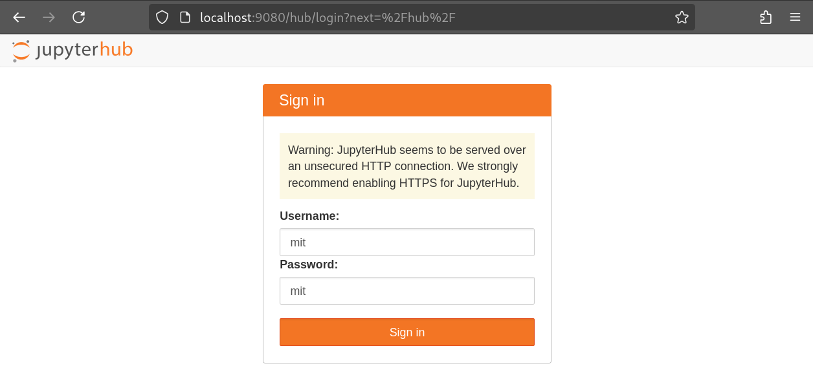

Once we sign in, a new pod will be created with the name jupyter-<user> 
> NAME                                 READY   STATUS    RESTARTS   AGE
> pod/continuous-image-puller-n57rd    1/1     Running   0          15m
> pod/hub-6cc5b4dcfb-kkgsx             1/1     Running   0          15m
> pod/jupyter-mit                      1/1     Running   0          14s
> pod/proxy-fc5667f5f-7kmms            1/1     Running   0          15m
> pod/user-scheduler-f4f4f6f8b-7t2fh   1/1     Running   0          55m
> pod/user-scheduler-f4f4f6f8b-zbz8g   1/1     Running   0          55m 

And on our browser we will see our custom kernel
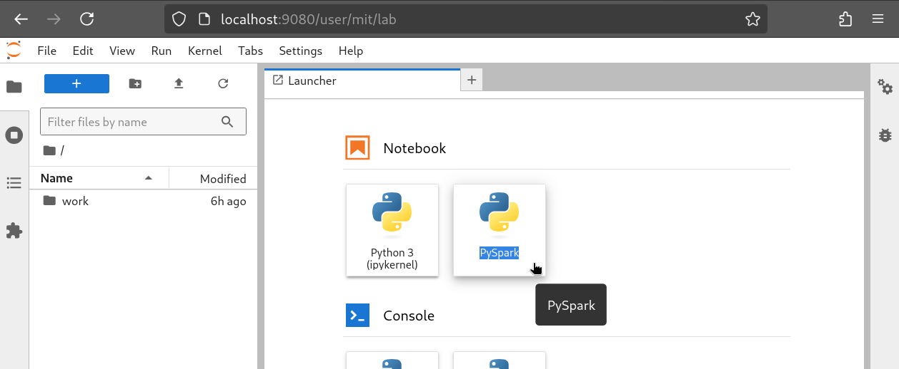

Lets create one final port forwarding from the pod jupyter-<user> in port 4040 as shown in [jupyter is spark driver](https://github.com/mitsiu-carreno/k8s-spark-lab/tree/main/jupyterhub#if-jupyter-is-spark-driver)

Now our spark cluster is finally ready! Let's test it out [counting the words in our demo bucket](https://github.com/mitsiu-carreno/k8s-spark-lab/blob/main/jupyterhub/word_count_jupyter.ipynb)

We can test the versions installed in jupyterhub, remember they must match the versions installed in our spark-cluster
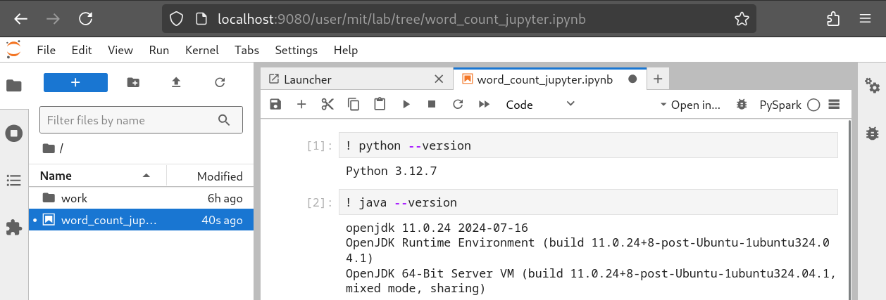

Notice that in our notebook, we set the values for spark master, our minio credentials, and tweaks about how many resources the spark-cluster should assign to this application. We also install some packages defined in "spark.jars.packages"

During the application execution we have access to **localhost:4040** where we can see and debug spark cluster performance and actions
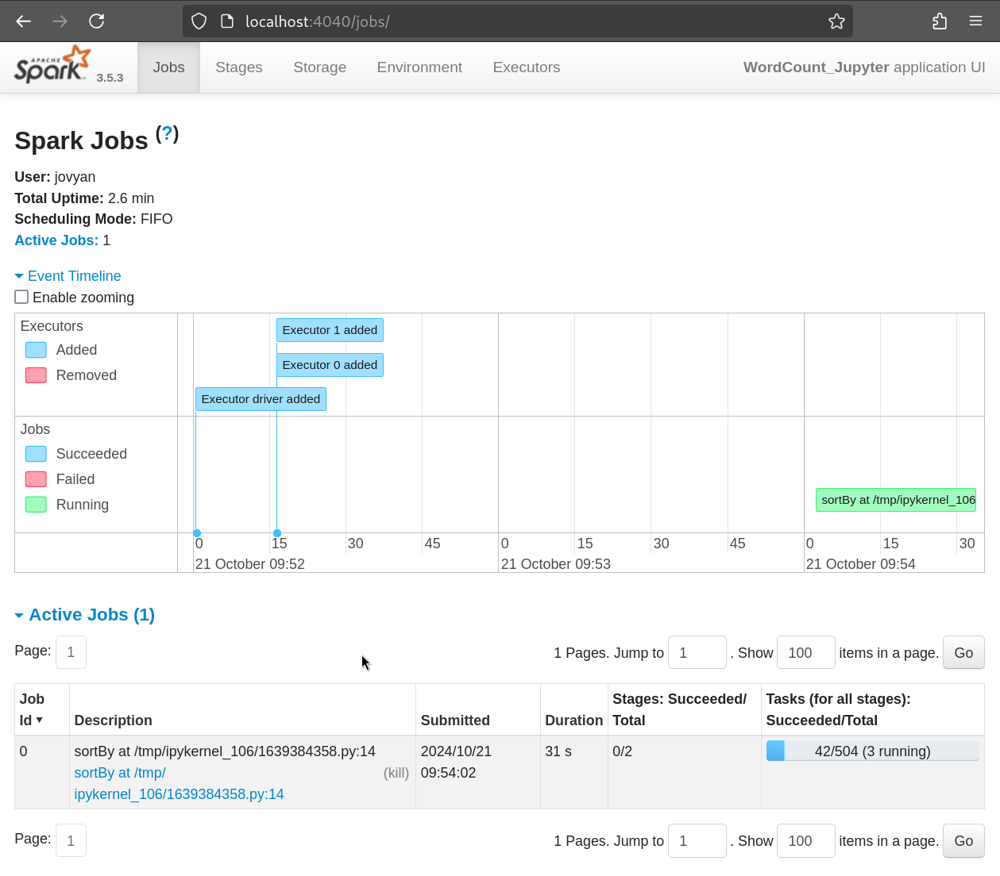

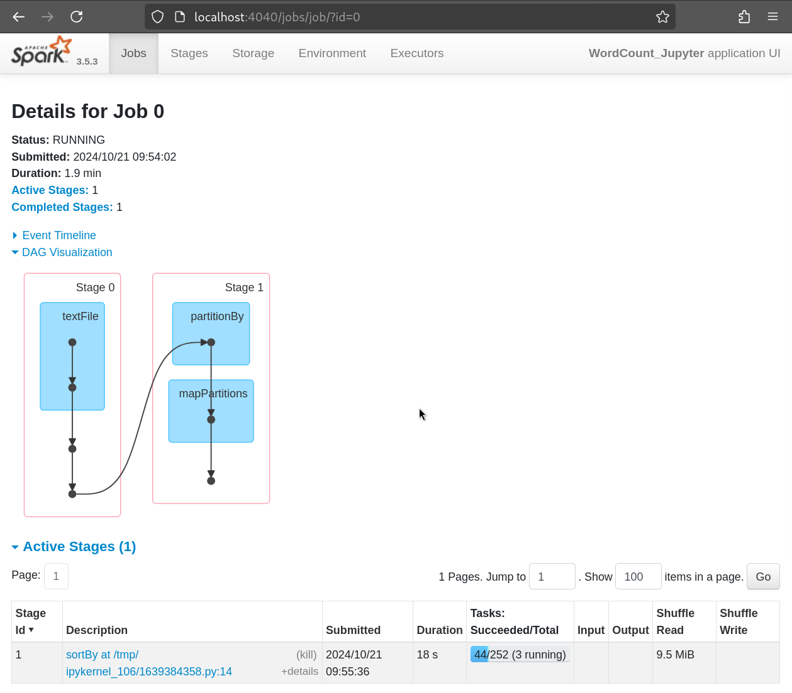

During the application execution, we can both read and write into minio cluster, and it will be available for all spark-worker nodes.
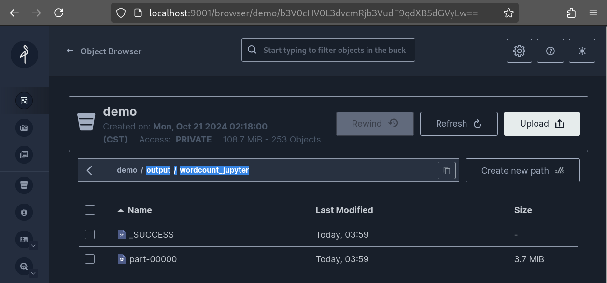

And that's all, pretty exahusting but also cool, too many steps? maybe, invaluable knowledge, definitely. But I agree, this whole setup might be too much, so I invite you to take a look into spark-operators I havent been able to try them but they are supposed to handle all this inter-service dependencies by itself, sounds cool. Anyway thanks for reading.
